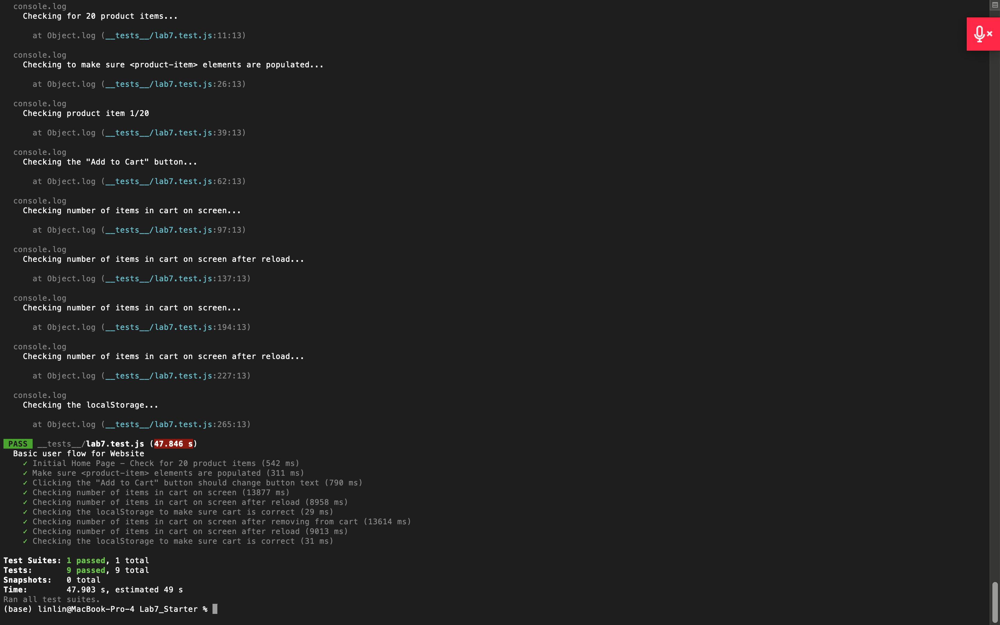

## name

Yilin Cai

---

## Check Understanding

### Q1) Where would you fit your automated tests in your Recipe project development pipeline?
 
I would put the tests **within a GitHub action that runs whenever code is pushed**.

**Explanation:**  
This makes sure that every time we change the code, the tests run automatically. It’s fast, easy, and helps catch bugs early before anything is merged. This way, we know our main branch always works.

---

### Q2) Would you use an end to end test to check if a function is returning the correct output?

No.

**Explanation:**  
End-to-end tests are used to test full user flows, like clicking buttons or saving items. To check if a function returns the right value, we use unit tests instead.

---

### Q3) What is the difference between navigation and snapshot mode?

**Navigation mode** runs a full test when the page loads. It checks how fast everything shows up and how well the site performs overall. I think It's useful for testing speed and user experience from start to finish.

**Snapshot mode** just looks at the page in its current state. It’s good for checking things like accessibility or layout, but it doesn’t test how the page loads or changes over time.

---

### Q4) Name three things we could do to improve the CSE 110 shop site based on the Lighthouse results.

1. **Reduce image sizes**: Some images are too big and slow down the page. We can compress or use next-gen formats like WebP.

2. **Add a viewport meta tag**: The site doesn’t have `<meta name="viewport">`, which is bad for mobile responsiveness.

3. **Add accessible names to buttons**: Some buttons are missing labels, which makes it harder for screen readers to understand them.

## Screenshot for testing

Below is the screenshot of all test results after running `npm test`:

